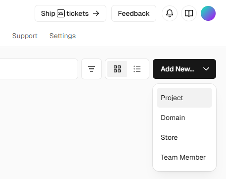
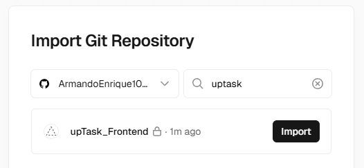
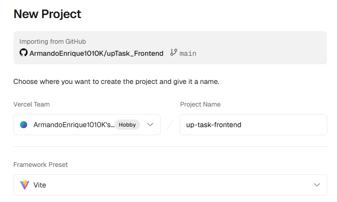
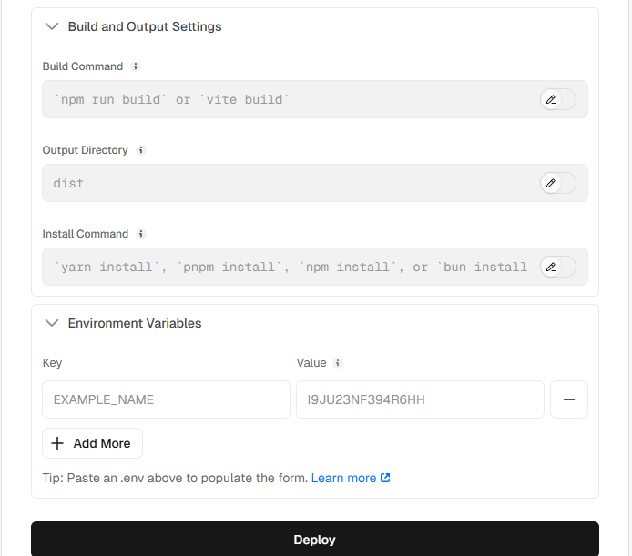
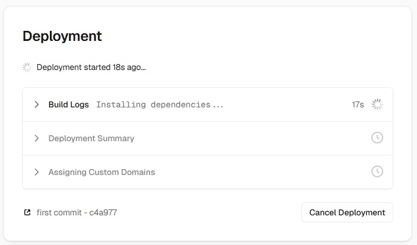
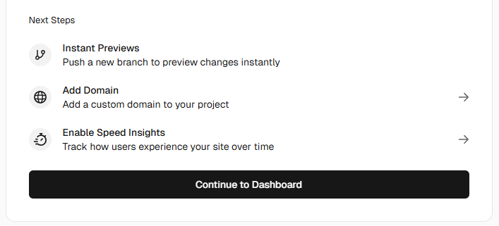
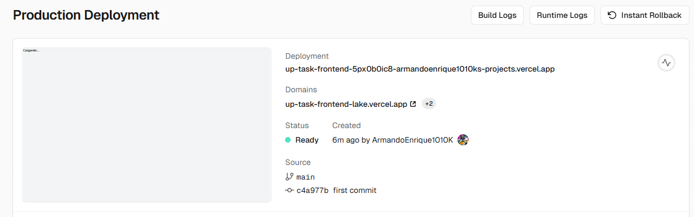
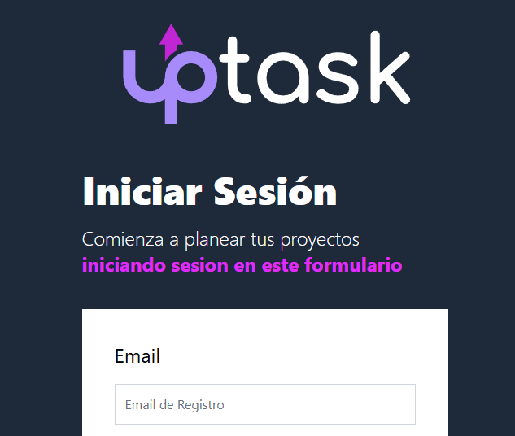

# Deployment del frontend en Vercel

No olvidar colocar el archivo `vercel.json` dentro de la carpeta del proyecto, fuera de src,

```json
{
  "routes": [
    {
      "src": "/[^.]+",
      "dest": "/",
      "status": 200
    }
  ]
}
```

Ejecuta npm run build en la terminal para asegurar de que no ocurra ningun error que falte solucionar en el proyecto.

MongoDB Atlas ya tiene la base de datos desplegada.

Sube todo el codigo del proyecto a un nuevo repositorio de github


No agregues un archivo README.

Ve al proyecto frontend desde VSCode y agrega los siguientes comandos

```shell
git init
git add .
git commit -m "first commit"
git branch -M main
git remote add origin https://github.com/ArmandoEnrique1010K/upTask_Frontend.git
git push -u origin main
```

git add . agrega todos los archivos que no estan en el gitignore

git branch -M main, crea el branch o la rama principal

Ahora en github ya se encuentra el codigo.

Ve a vercel, a la pagina de inicio, clic en Add New, selecciona proyects



Importa el repositorio donde esta el proyecto



Selecciona el framework vite



Por el momento, no colocar variables de entorno



Porque se tiene que desplegar el backend para agregar las variables de entorno

Hara el deployment del proyecto



Seguidamente ve al dashboard



Haz clic en el enlace del dominio



https://up-task-frontend-lake.vercel.app/


En ese caso, haz clic en el enlace y se mostrara la pagina de inicio de sesion del proyecot (segun lo definid oen routes como pagina de inicio)


