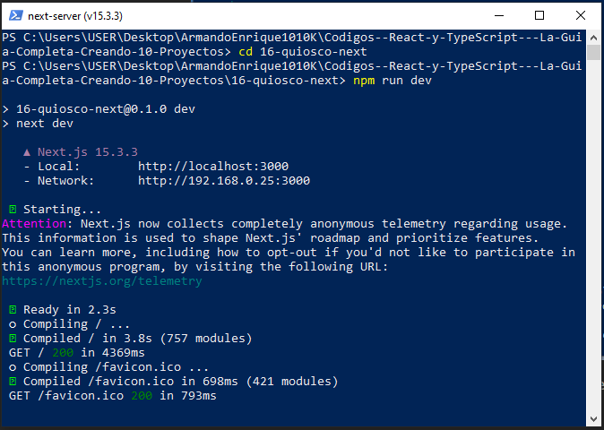

# NEXT.JS

El framework de React para web

Next.js es un framework de React para la construcción de sitios y aplicaciones Full Stack, puedes utilizar componente de React para crear tu sitio y Next.js para caracteristicas muy especificas y optimizaciones.

Next.js se encarga de compilar tu aplicación, por lo tanto solo te preocupas por crear tu app y no por la configuración

Su principal caracteristica es que ejecuta React en el servidor.

## Principales caracteristicas

RENDERING: Puede ejecutar codigo de cliente y servidor, este componente se ejecuta en el cliente o el servidor

OPTIMIZACIONES: Incluye cache, optimizaciones para imagenes, rutas, etc; gran cantidad de optimizaciones

Soporta typescript, además de javascript

Routing: incluye routing sin instalar alguna libreria

Data fetching: diferentes formas de obtener datos desde una API, data fetching

## Next Routers: App y Pages Router

Desde la versión 13, Next.js tiene 2 routers: App y Pages Router

Para proyectos nuevos, el recomendado es App Router, el equipo de Vercel ha mencionado que no planean eliminar pages Router, pero todas las nuevas  caracteristicas de Next.js son agregadas al App Router.

El codigo entre App y Pages Router es muy diferente en especial para nombrar archivos y obtener datos.

## CREANDO EL PROYECTO DE NEXTJS

Ejecuta

```shell
npx create-next-app@latest
```

Si te pide instalar un paquete como create-next-app@15.3.3 solamente escribe "Y" y pulsa Enter

Escribe el nombre del proyecto

Selecciona Yes para poder habilitar typescript en el proyecto

EsLint tambien, TailwindCSS, tambien,

Would you like your code inside a `src/` directory?

Esa pregunta especifica que src directo es parte de app router, genera las rutas en src/app, aunque no pueda ser una buena opcion porque tu creas la estructura de carpetas, selecciona No

Would you like to use App Router? (recommended) » No / Yes

Pregunta si quieres usar AppRouter, pulsa Yes

? Would you like to use Turbopack for `next dev`? » No / Yes, selcciona NO

Por ultimo pregunta tambien si quieres personalizar los alias @/*

, coloca NO

Comenzara a instalar dependencias.


Una diferencia es que nextjs ya no hace falta instalar dependencias porque ya lo hace

Escribe `npm run dev` y comenzara a ejecutar el proyecto, pulsa CTRL + C para detener el servidor



Ve a http://localhost:3000/ desde un navegador


Abre el proyecto en VScode, la estructura es diferente


la carpeta app es el app router,

next.config.ts, configuraciones de next

tailwind.config.ts no existe porque tailwind esta en la version 4

Hay reglas en nextjs

global.css contiene la hoja de estilos que se aplicara que manera global

layout.tsx --> metadata y layout???

```tsx
// Titulo y descripción
export const metadata: Metadata = {
  title: "Quioso Next.js con App Router y Prisma",
  description: "Quioso Next.js con App Router y Prisma",
};
```

page.tsx,

define las rutas

Imprime hola mundo

```tsx
// Mensaje de hola mundo en la vista del usuario
export default function Home() {
  return <h1>Hola Mundo Next.js</h1>;
}

```

Guarda los cambios y se detecta los cambios y actualiza automaticamente el navegador.


